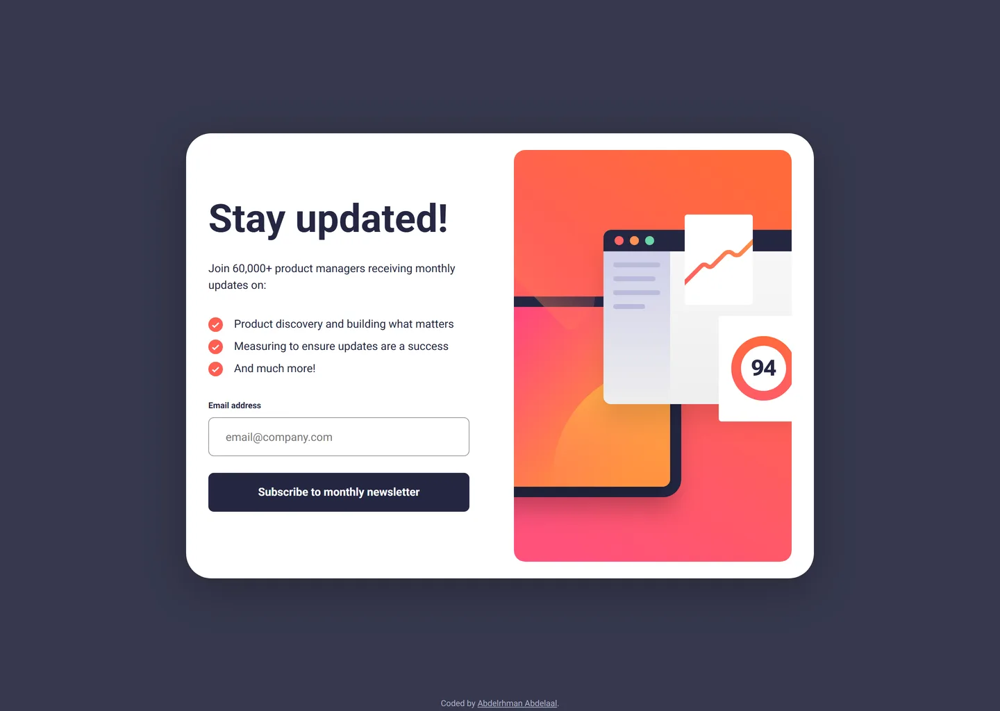

# Frontend Mentor - Newsletter sign-up form with success message solution

This is a solution to the [Newsletter sign-up form with success message challenge on Frontend Mentor](https://www.frontendmentor.io/challenges/newsletter-signup-form-with-success-message-3FC1AZbNrv). Frontend Mentor challenges help you improve your coding skills by building realistic projects.

## Table of contents

- [Overview](#overview)
  - [Screenshot](#screenshot)
  - [Links](#links)
- [My process](#my-process)
  - [Built with](#built-with)
  - [Design deviations](#design-deviations)
- [Author](#author)

## Overview

### Screenshot

### Links

- Solution URL: [GitHub](https://github.com/MrBlackvanta/newsletter-sign-up-with-success-message)
- Live Site URL: [Netlify](https://vanta-newsletter-sign-up-with-success.netlify.app)

## My process

### Built with

- [Next.js 16](https://nextjs.org/) (App Router, React Compiler, Turbopack)
- [React 19](https://react.dev/)
- [TypeScript](https://www.typescriptlang.org/) (strict)
- [Tailwind CSS v4](https://tailwindcss.com/)

### Design deviations

Colours come from the `.fig` rather than `style-guide.md`, whose HSL values round a point
off on two of the four: `hsl(4, 100%, 67%)` resolves to `#FF6257` where the file paints
`#FF6155`, and `hsl(235, 18%, 26%)` to `#36384E` against the file's `#36384D`. Two paints
the style guide omits entirely: `#FFE7E6` for the error field and the button's hover
gradient, `#FF527B → #FF6A3A`.

Every text and boundary pairing was measured against its actual backdrop. Six failed WCAG
AA — four against 1.4.3's 4.5:1, and the border and check circle against 1.4.11's 3:1 —
and each moved by the smallest amount that clears its threshold, hue and saturation held:

| Role                            | Design     | Shipped   | Contrast before → after |
| ------------------------------- | ---------- | --------- | ----------------------- |
| Placeholder                     | `#949494`  | `#767676` | 3.03 → **4.54**         |
| Input border                    | `~#C6C6C6` | `#949494` | 1.71 → **3.03**         |
| Bullet check circle             | `#FF6155`  | `#FF5E52` | 2.96 → **3.01**         |
| Error message, field and border | `#FF6155`  | `#D70F00` | 2.96 → **5.31**         |
| Typed text in the error field   | `#FF6155`  | `#D70F00` | 2.51 → **4.50**         |
| Hover button label              | `#FFFFFF`  | `#242742` | 2.85 → **4.67**         |

Three of those need explaining:

- **The input border is read from the design JPG, not the `.fig`** — the parser reports
  fills, not strokes. All four edges measure `#C4C4C4`–`#C8C8C8` at 1px, so the design's
  outline is far lighter than the style guide's grey and `#949494` is the minimum that
  clears 1.4.11. The method is validated on the same export: the focused border measures
  `#2A2833` against a true `#242742`, and the error border's luma (145) matches `#FF6155`
  (143) — its colour only _looks_ washed out because JPEG chroma subsampling smears thin
  red lines.
- **The error red is one token for three things** — message, typed text and border. It is
  `#FF6155` with hue and saturation fixed (H 4.24° → 4.19°, S 100%) and lightness dropped
  from 66.7% to 42.2%, rather than a neutral substitute.
- **The hover gradient is untouched.** White on it reads 3.11 at the pink end and 2.85 at
  the orange end, so the _label_ flips to `#242742` instead — 4.67 at the worst point along
  the ramp, and the large coloured area stays exactly as designed.

The attribution needs two values, `#767676` and `#ABADC2`: below 640px it sits on the
white card and above it on the `#36384D` page, and no single neutral grey clears 4.5:1 on
both.

Other notes:

- **The desktop JPG is stale relative to the `.fig`.** Its card measures 928 wide with 64
  left / 24 right padding, against the file's internally consistent 904 and symmetric 32.
  The build follows the file, so an overlay on `desktop-design.jpg` sits 12px narrower per
  side.
- **The tablet frame's label claims 16px inside an 18px box**, which 1.5 line-height cannot
  produce. Desktop and mobile both specify 12px, so 12px it is. That frame also uses a
  16px input-to-button gap where the other two use 24px, and fractional 42.86px card
  padding that only exists because the illustration is 358.29px tall — both normalised (24
  and 40), costing 2px of card height.
- **The tablet illustration reproduces the design's vertical crop.** The artwork is the
  mobile SVG scaled 1.408×, whose natural height at 528px wide would be 400px against the
  frame's 358.29px; the mask clips roughly 7px off the top and 34px off the bottom, which
  is `object-cover` at `center 18%`. It also removes the SVG's baked bottom radius, which
  would otherwise scale to 22.5px inside a 16px container.
- **Both breakpoints are mine.** The design ships 375, 768 and 1440 frames with nothing in
  between, so 640px switches the full-bleed phone layout to a card and 1024px switches the
  stacked card to two columns — 904px cannot fit at 768. The mobile success screen's 144px
  top gap rounds the frame's 149px, which is not a designed value: the two mobile exports
  are 842px and 812px tall.
- **The card sits ~10px above the design's vertical centre**, because the attribution is a
  real row in the page's flex column and the Frontend Mentor frames have no footer.
- **The email field replaces the user-agent focus ring rather than removing it.** Focus is
  signalled by the design's own border change to `#242742` (14.54:1), with a transparent
  2px outline retained for forced-colors mode; buttons and links keep a 2px `#242742` ring
  on `:focus-visible`.
- **One validation message covers both failure modes.** "Valid email required" is the only
  error string in the design, and it is shown for an empty field and a malformed address
  alike — decided by `input.validity` rather than a hand-written pattern. It renders beside
  the label on the same row, so an error causes no layout shift.
- **The hover fill cross-fades over 200ms**, which the static design cannot specify either
  way. `background-image` is not an interpolable property, so the gradient sits on a
  `::before` layer whose opacity animates while the label colour and shadow transition
  alongside it; `isolation: isolate` is what keeps that layer above the button's fill and
  below its label. All three transitions are dropped under `prefers-reduced-motion: reduce`.
- **The illustrations stay SVG.** They are vector in the starter files, and rendering them
  to WebP costs 4–7× the bytes at the sizes a 2× display needs (1.8KB brotli against 8–13KB)
  while going soft above the variant shipped. `<picture>` art-directs the two files, which
  is why they are plain `` rather than `next/image`.

## Author

- UpWork - [Abdelrhman Abdelaal](https://upwork.com/freelancers/~01f0a9479696b61f49)
- Frontend Mentor - [@MrBlackvanta](https://www.frontendmentor.io/profile/MrBlackvanta)
- LinkedIn - [Abdelrhman Abdelaal](https://www.linkedin.com/in/abdelrhman-vanta/)
